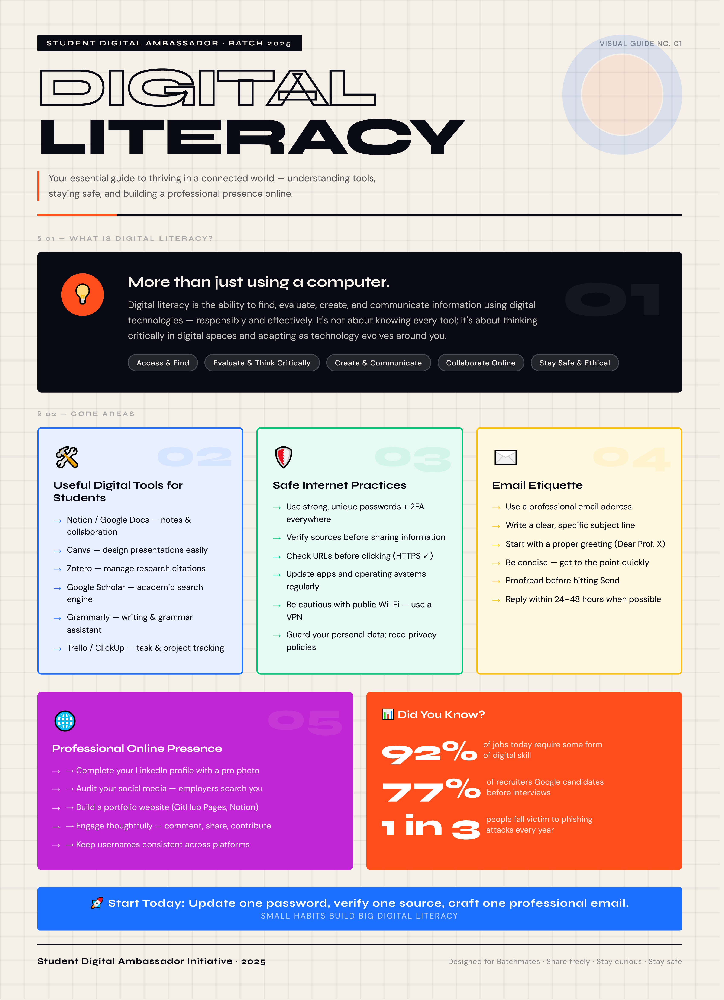

#  CSE0001 – Digital Literacy Portfolio

> **Student Digital Ambassador Project** | VIT Bhopal University | VITyarthi E-Learning Platform

---

##  Student Details

| Field | Details |
|-------|---------|
| **Name** | Bhavya Chourey |
| **Registration No.** | 25MIM10037 |
| **Branch** | Integrated M.Tech – Artificial Intelligence |
| **Year** | First Year (2025–26) |
| **Course Code** | CSE0001 – Digital Literacy |
| **GitHub** | [@Bhavya-Chourey](https://github.com/Bhavya-Chourey) |

---

##  Repository Structure

```
digital-literacy-project/
│
├── README.md                                        ← You are here
│
├── report/
│   └── Project_Report.md                            ← Full written report (all 5 tasks)
│
├── task-1-presentation/
│   ├── digital_literacy_infographic.png             ← Canva infographic
│   └── description.md                               ← Tool used & topic breakdown
│
├── task-2-portfolio/
│   ├── github_profile.png                           ← GitHub profile screenshot
│   ├── linkedin_profile.png                         ← LinkedIn education section screenshot
│   ├── kaggle_profile.png                           ← Kaggle profile screenshot
│   └── task2_report.md                              ← Platform notes & reflection
│
├── task-3-platforms/
│   ├── hackerrank_challenge.png                     ← Solve Me First completion screenshot
│   ├── google_form.png                              ← Digital Literacy Quiz form screenshot
│   ├── google_sheet_responses.png                   ← Linked Google Sheet with 5 responses
│   └── task3_report.md                              ← Platform notes
│
├── task-4-email-etiquette/
│   ├── professional-emails.md                       ← Two professional email drafts
│   ├── social-media-checklist.md                    ← Social media Do's & Don'ts
│   └── task4_report.md                              ← Platform notes
│
└── task-5-cybercrime/
    ├── casestudy.md                                 ← UPI Fraud case study
    ├── prevention-checklist.md                      ← Stay Safe Online checklist
    └── task5_report.md                              ← Platform notes
                      
```

---

## Module Summaries

###  Task 1 – Digital Literacy Awareness Infographic `Module 1 | 20 marks`

Created a one-page visual infographic titled **"Digital Literacy"** using **Canva**, designed for first-year batchmates under the Student Digital Ambassador Initiative (Batch 2025).

**Topics covered:**
- **What is Digital Literacy?** — Ability to find, evaluate, create & communicate using digital tech responsibly. Core pillars: Access & Find, Evaluate & Think Critically, Create & Communicate, Collaborate Online, Stay Safe & Ethical.
- **Useful Digital Tools for Students** — Notion, Google Docs, Canva, Zotero, Google Scholar, Grammarly, Trello/ClickUp
- **Safe Internet Practices** — Strong passwords + 2FA, verify sources, check URLs (HTTPS), update apps, avoid public Wi-Fi
- **Email Etiquette** — Professional address, clear subject line, proper greeting, concise body, proofread, reply within 24–48 hrs
- **Professional Online Presence** — LinkedIn, GitHub Pages, social media audit, consistent usernames

**Did You Know?** 92% of jobs require digital skills · 77% of recruiters Google candidates · 1 in 3 people fall victim to phishing

 **Infographic:**



---

###  Task 2 – Student Digital Portfolio `Module 2 | 20 marks`

Set up professional profiles on **three platforms** with education details, goals, and bio.

| Platform | Profile | Purpose |
|----------|---------|---------|
|  **GitHub** | [@Bhavya-Chourey](https://github.com/Bhavya-Chourey) | Code hosting, version control, AI project portfolio |
|  **LinkedIn** | [Bhavya Chourey](https://www.linkedin.com/in/bhavya-chourey) | Professional networking, internship search |
|  **Kaggle** | [bhavyachourey](https://www.kaggle.com/bhavyachourey) | Data science competitions, ML/AI practice |

**GitHub Profile README highlights:**
- Degree: Integrated M.Tech in Artificial Intelligence | VIT Bhopal University | First Year / 2025–30
- Goal: *"Bridge the gap between complex mathematical theory and practical AI applications, focusing on deep learning and neural networks."*
- Tech: Python, C++ | Interests: Machine Learning, Computer Vision, Data Analysis

**LinkedIn Education:**
- Integrated MTech, AI – VIT Bhopal University (Aug 2025 – Aug 2030)
- HSC [PCM] – Govt. Excellence Higher Secondary School | Grade: 90.2%
- SSC – Govt. Excellence Higher Secondary School | Grade: 88.6%

 Screenshots in `task-2-portfolio/`

---

###  Task 3 – Coding & Collaboration Platforms `Module 3 | 20 marks`

#### Part A – HackerRank (Coding Practice)
- **Challenge:** Solve Me First (Algorithms → Warmup)
- **Result:** 1.00 / 1 point scored 
- **Category:** Easy | Submitted by 5,029,500+ users
- **Task:** Implemented `solveMeFirst` function to return sum of two integers

#### Part B – Google Forms (Collaboration)
- **Form:** Digital Literacy Awareness Quiz (5 questions, Published )
- **Includes:** Multiple choice, checkboxes, linear scale, and short answer questions
- **Responses collected:** 5 real responses from batchmates (as of 29 March 2026)

🔗 **[Take the Digital Literacy Awareness Quiz →](https://forms.gle/kQnufhYCGBMkd9HA8)**

 Screenshots in `task-3-platforms/`

---

###  Task 4 – Professional Email & Etiquette Guide `Module 4 | 20 marks`

#### Part A – Email Drafts (`email-drafts.docx`)

**Email 1 – Assignment Extension Request**
> **Subject:** Extension Request: Calculus Assignment – Bhavya Chourey – 25MIM10037
> Formally requests a one-day extension due to a technical complication, with professional greeting, clear reason, specific revised date, and proper sign-off.

**Email 2 – Summer Internship Inquiry**
> **Subject:** Inquiry: Summer Internship Opportunity - AI & Machine Learning - Bhavya Chourey
> Expresses interest in an AI/ML internship, highlights academic background (Python, calculus for AI, ML models), and requests a discussion opportunity.

Both emails follow all professional conventions: clear subject line · formal salutation · structured body · proper sign-off.

#### Part B – Social Media Do's & Don'ts (`social-media-checklist.md`)

| ✅ DO's | ❌ DON'Ts |
|--------|----------|
| Think before you post | Post offensive or hateful content |
| Keep profiles professional | Overshare personal information |
| Use privacy settings wisely | Cyberbully or harass others |
| Give credit for shared content | Plagiarize others' work |
| Engage positively & constructively | Post impulsively when upset |
| Log out on shared/public devices | Neglect your mental health |

---

###  Task 5 – Cybercrime Awareness Case Study & Prevention Guide `Module 5 | 20 marks`

#### Part A – Case Study: UPI / Online Payment Fraud (`casestudy.md`)

A realistic fictional scenario of a first-year college student in Madhya Pradesh who lost ₹8,500 after scanning a fraudulent QR code sent by a fake buyer for a second-hand laptop listed online.

**How the fraud works (step-by-step):**
1. Attacker identifies victim on OLX / Facebook Marketplace
2. Contacts victim posing as a genuine buyer (often fake military/govt identity)
3. Says *"scan this QR code to receive payment"* — actually a collect request
4. Victim enters UPI PIN → money is debited, not credited
5. Funds routed through mule accounts → victim blocked immediately

**Targets:** College students, marketplace sellers, senior citizens, job seekers  
**Consequences:** Instant irreversible financial loss, psychological harm, academic hardship

#### Part B – Stay Safe Online Checklist (`prevention-checklist.md`)

10 actionable tips including:
- 🔴 Never share OTP / UPI PIN / CVV / Password
- 🔴 Never scan a QR code to "receive" money
- 🔴 Never click unknown links on WhatsApp/SMS
- 🟢 Set daily UPI transaction limits + enable alerts
- 🟢 Always verify before paying or sharing info

🚨 **Report cybercrime:** [cybercrime.gov.in](https://cybercrime.gov.in) | Helpline: **1930** (24×7)

---

## 🔗 Quick Links

| Resource | Link |
|----------|------|
|  Digital Literacy Quiz | [forms.gle/kQnufhYCGBMkd9HA8](https://forms.gle/kQnufhYCGBMkd9HA8) |
|  GitHub Profile | [github.com/Bhavya-Chourey](https://github.com/Bhavya-Chourey) |
|  LinkedIn Profile | [linkedin.com/in/bhavya-chourey](https://www.linkedin.com/in/bhavya-chourey-56aa92250/) |
|  Kaggle Profile | [kaggle.com/bhavyachourey](https://www.kaggle.com/bhavyachourey) |
|  HackerRank | [hackerrank.com](https://www.hackerrank.com) |
|  Cybercrime Portal | [cybercrime.gov.in](https://cybercrime.gov.in) \| Helpline: **1930** |

---

##  Tools & Platforms Used

`Canva` `GitHub` `LinkedIn` `Kaggle` `HackerRank` `Google Forms` `Google Sheets` `Microsoft Word`

---

##  Marking Scheme

| Component | Marks |
|-----------|-------|
| Task 1 – Infographic | 20 |
| Task 2 – Digital Portfolio | 20 |
| Task 3 – Platforms | 20 |
| Task 4 – Email Etiquette | 20 |
| Task 5 – Cybercrime | 20 |
| Repository Structure (Bonus) | +5 |
| **Total** | **100** |

---

##  Academic Integrity

All written reflections are in my own words. AI tools (Claude) were used to understand concepts and assist with structure, but all content reflects my own understanding and experience. External sources are cited in the project report.

---

*Student Digital Ambassador Initiative · VIT Bhopal University · 2025–26*  
*Designed for Batchmates · Share freely · Stay curious · Stay safe*


